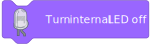
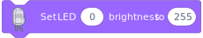

# Blocks

## Events

### 

This block is already there when a new project gets loaded, so it doesn't need to be dragged into the workspace manually.

Everything connected to this block will be executed when the program starts (when the green flag is clicked)

## Components

These blocks can turn a LED on or off on a PIN. The (0) in this field can be edited to use a different PIN.

Like in normal MicroPython programming the pins start at 0.

---

This block has the "boolean form", this block can be inserted into other blocks to read a yes/no value, in this case whether a LED on pin X is on or off.

---

These blocks can turn the internal LED on or off. The internal LED is the LED on the Pico board itself.

---

This block has the "boolean form", this block can be inserted into other blocks to read a yes/no value, in this case whether the internal LED is on or off.

---

This block can set the brightness of a LED on a PIN. The (0) in this field can be edited to use a different PIN. The (255) in this field can be edited to set a different brightness from 0-255.

---

This block has the "number form", this block can be inserted into other blocks to read a number value, in this case what brightness (0-255) a LED has, which can be set with the Set LED brightness block.

---

This block again has the "boolean form", with this you can check if a button on pin X is pressed down or not.

---

This block has the "number form", this block can be inserted into other blocks to read a number value, in this case what value (0-255) a potentiometer is set to.

---

This block has the "number form", this block can be inserted into other blocks to read a number value, in this case what light level (0-255) a photoresistor is reading.

---

This block can set the color of a RGB LED on a PIN. The fields next to R, G, B are for the red, green and blue pins of the RGB LED. The last field can be used to select a color from a color picker, the color picker currently does not allow variables to be inserted, so using individual [Set LED brightness to] blocks to set r, g and b values is recommended for now.

---

This block has the "number form", this block can be inserted into other blocks to read a number value, in this case what distance (in cm) a ultrasonic sensor is reading.
The inputs for the ultrasonic sensor are the trigger pin and the echo pin.

---

This block again has the "boolean form", with this you can check if a PIR sensor on pin X (connected to the middle pin of the PIR sensor) is detecting motion or not.

## Debug

Unlike how the name suggests, these blocks are not only for debugging, but can also be used to interface with the console, or use python code that PicoScratch does not support yet.

---

This block can print text to the console. The value can be a number, text or a boolean.

---

This block has the "string form", this block can be inserted into other blocks to read a text value, in this case what text is typed into the console.
In addition, the block can also add a prompt to the console, which can be used to ask the user for input.

---

This block can run arbitrary python code. For security reasons, you can not insert variables into this block.
