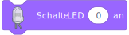

# Blöcke

## Ereignisse

Dieser Block ist bereits da wenn ein neues Projekt geladen wird, also muss er nicht manuell in die Arbeitsfläche geschoben werden.

Alles was mit diesem Block verbunden ist wird beim starten des Programm Code (beim drücken der grünen Flagge) ausgeführt

## Komponente

Diese Blöcke können die LED auf einem PIN ein oder aus schalten. Die (0) bei diesem Feld kann man bearbeiten um einen eigenen Pin einzugeben.

Wie bei der normalen MicroPython Programmierung fangen die Pins bei 0 an.

---

Dieser Block hat die "boolean form", diesen Block kann man in andere Blöcke reinsetzen um einen Wert ja/nein Wert auszulesen, in dem Fall ob eine LED auf Pin X an oder aus ist.

---

Dieser Block hat die "number form", diesen Block kann man ebenfalls in andere Blöcke reinsetzen um einen Zahlenwert auszulesen, in diesem Fall welche Helligkeit (0-255) eine LED hat, welche mit einem anderem Block eingestellt werden kann.

---

Dieser Block hat erneut die "boolean form", hiermit kann man abfragen ob ein Knopf auf Pin X gedrückt ist