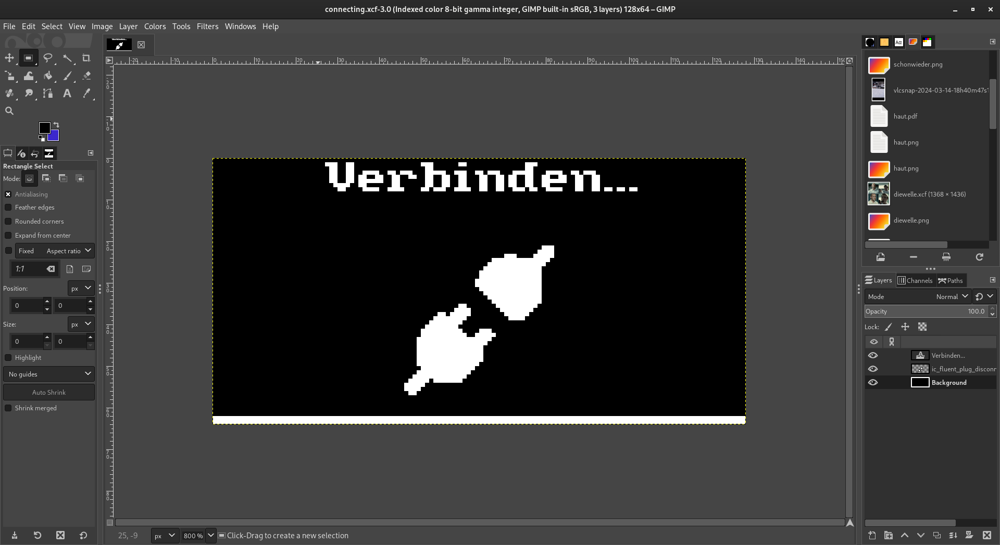

# Verwendung von PBM-Bildern

Das PBM (**P**ortable **B**it**m**ap)-Dateiformat ist ein sehr einfaches Dateiformat, das zum Speichern von Schwarz-Weiß-Bildern verwendet werden kann, die einfach direkt in einen `framebuf` eingelesen und nach einer gewissen Bearbeitung auf das OLED-Display ge`blit`-ed werden können.

## Erstellen eines PBM-Bildes

Sie können ein PBM-Bild mit einem beliebigen Bildbearbeitungsprogramm wie [GIMP](https://www.gimp.org/) erstellen, das den Export nach PBM unterstützt. Das Bild sollte schwarz-weiß sein, mit einer Bildgröße von 128x64 Pixeln für die gesamte Anzeige, oder etwas kleiner für ein kleineres Bild, wie ein Icon.



## Lesen eines PBM-Bildes

Um ein PBM-Bild in einen `framebuf` zu lesen, können Sie die Methode `display.readPBM(filename)` verwenden. Diese Methode gibt ein `framebuf`-Objekt zurück, das Sie verwenden können, um das Bild auf dem OLED-Display aufzu`blit`-en.

```python
from display import oled, readPBM
from time import sleep

# Einlesen des PBM-Bildes
image = readPBM("connecting.pbm")

# Leeren des Displays
oled.fill(0)

# Das Bild wird an der Position (0, 0) auf dem Display angezeigt
oled.blit(image, 0, 0)

# Aktualisieren der Anzeige
oled.show()

# Warten bis zum Ende
sleep(3)
```

::: details Wie funktioniert es?
Die Methode `readPBM` liest zunächst die Datei in einen String und beginnt dann, diese Zeile für Zeile zu lesen.

| Zeile | Beispiel | Beschreibung |
| --- | --- | --- |
| 1 | `P1` | Die magische Zahl, die die Datei als PBM-Datei kennzeichnet. |
| 2 | `# Dies ist ein Kommentar` | Ersteller Kommentar, ignoriert |
| 3 | `128 64` | Die Breite und Höhe des Bildes in Pixeln. |
| ... | &lt;binäre Daten&gt; | Bilddaten |

Die Bilddaten werden direkt in einen `framebuf` mit der in der Datei angegebenen Breite und Höhe eingelesen.
Danach wird es invertiert, um das richtige Bild auf dem OLED-Display anzuzeigen.
:::
