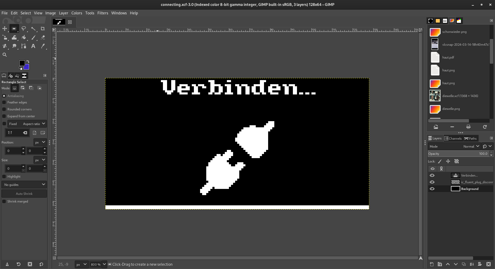

# Working with PBM Images

The PBM (**P**ortable **B**it**m**ap) file format is a very simple file format that can be used to store black-and-white images, which can easily be read directly into a `framebuf` and `blit`-ed onto the OLED display after some processing.

## Creating a PBM Image

You can create a PBM image using any image editing software like [GIMP](https://www.gimp.org/) that supports exporting to PBM. The image should be black-and-white, with an image size of 128x64 pixels for the entire display, or anything lower than that for a smaller image, like an icon.



## Reading a PBM Image

To read a PBM image into a `framebuf`, you can use the `display.readPBM(filename)` method. This method will return a `framebuf` object that you can use to `blit` the image onto the OLED display.

```python
from display import oled, readPBM
from time import sleep

# Read the PBM image
image = readPBM("connecting.pbm")

# Clear the display
oled.fill(0)

# Blit the image onto the display at position (0, 0)
oled.blit(image, 0, 0)

# Update the display
oled.show()

# Wait until exit
sleep(3)
```

::: details How does it work?
The `readPBM` method firstly reads the file into a string and starts reading it line by line.

| Line | Example | Description |
| --- | --- | --- |
| 1 | `P1` | The magic number that identifies the file as a PBM file. |
| 2 | `# This is a comment` | Creator Comment, ignored |
| 3 | `128 64` | The width and height of the image in pixels. |
| ... | &lt;binary data&gt; | Image data |

The image data is read directly into a `framebuf` with the width and height specified in the file.
After that, it is inverted to show the correct image on the OLED display.
:::
